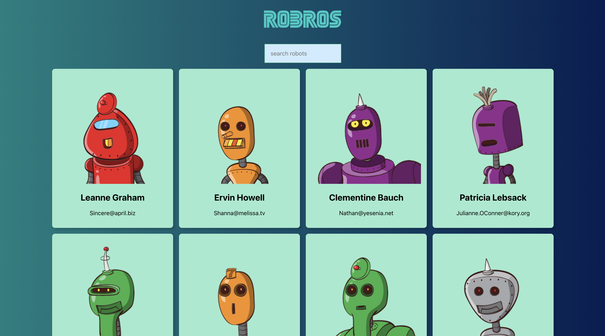

# 🤖 RoBros 🤖

Welcome to RoBros! A fun, interactive, and responsive front-end application that allows users to search a unique directory of robot friends.

## 🔍 Features 🔍

- **Searchability**: As you type in the search bar, the directory automatically filters to match your query. Finding your robot friend is just a keystroke away!
- **Unique Robot Profiles**: Each robot friend is unique. RoBros utilizes data from the [JSON Placeholder API](https://jsonplaceholder.typicode.com/users) and generates a unique robot image for each friend using [Robohash](https://robohash.org/).

## 🛠️ Built With 🛠️

- [React](https://reactjs.org/) (using Create-React-App)
- [React Hooks](https://reactjs.org/docs/hooks-intro.html)
- [Tachyons](https://tachyons.io/) for quick + responsive CSS styling

## 🚀 Getting Started 🚀

To get a local copy up and running, follow these steps:

1. Clone the repository:
   git clone https://github.com/jkracz/robros.git

2. Install the dependencies:
   cd robros
   npm install

3. Start the development server:
   npm start

Your local copy of RoBros will be available at `http://localhost:3000`.

## 🎯 Live Demo 🎯

Check out RoBros live in action [here](https://jkracz.github.io/robros/).

## 📫 Contact 📫

Joe Kracz - joseph.kracz@gmail.com

Project Link: [https://github.com/jkracz/robros](https://github.com/jkracz/robros)

## ✨ Acknowledgements ✨

- [Create React App](https://github.com/facebook/create-react-app)
- [Tachyons](https://tachyons.io/)
- [JSON Placeholder](https://jsonplaceholder.typicode.com/users)
- [Robohash](https://robohash.org/)
